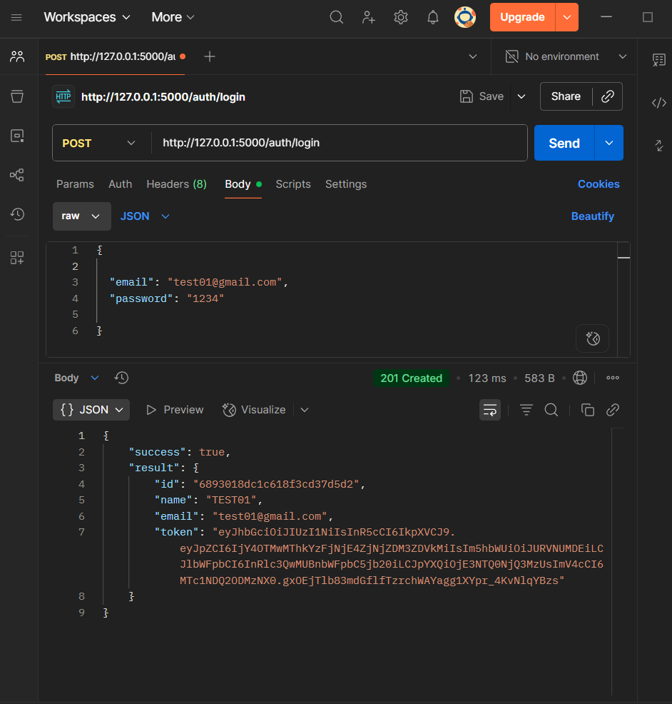
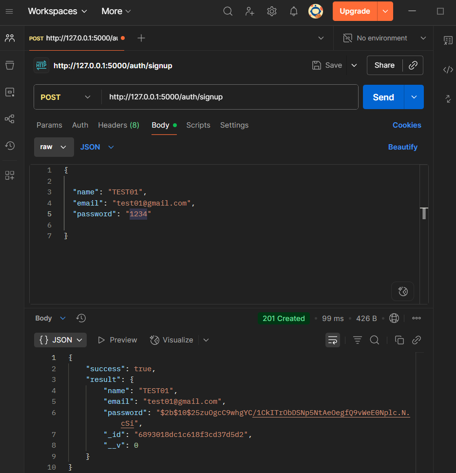
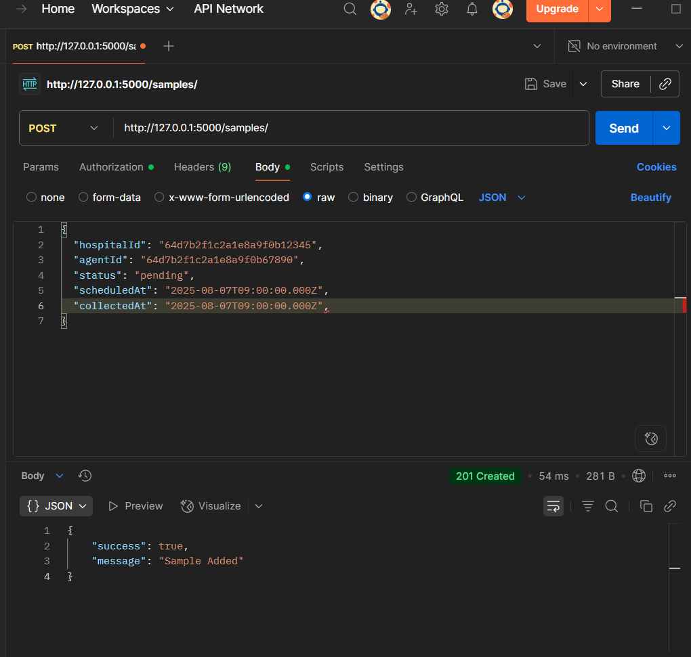
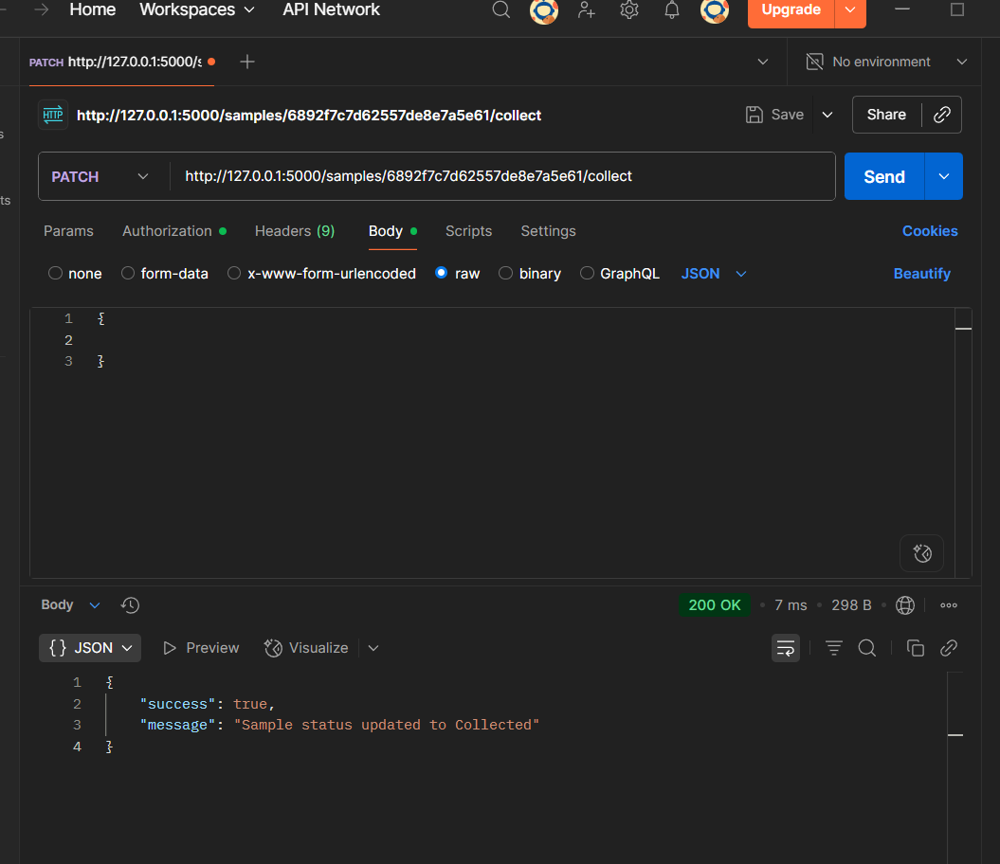
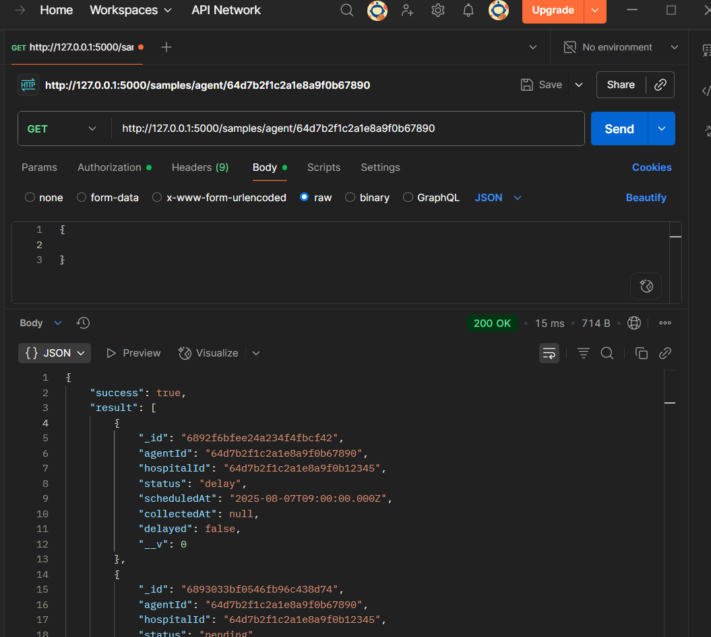
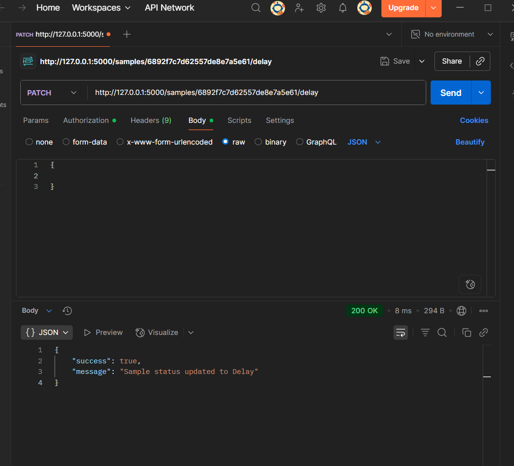

## MEDOC Backend API

### Project Setup

1. Clone the repository:

   ```bash
   git clone https://github.com/rehanp1/medoc
   cd medoc
   ```

2. Install dependencies:

   ```bash
   npm install
   ```

3. Set up environment variables:

   - Create a `.env` file in the root directory
   - Add your MongoDB URI and secret key:
     ```env
     MONGO_URI=mongodb://localhost:27017/medoc
     SECRET_KEY=yourSecretKey
     PORT=5000
     ```

4. Run the project:
   - Development: `npm run dev`
   - Build: `npm run build`
   - Production: `npm run start`

---

### API Documentation

#### Add New Sample

`POST /samples`

#### Mark Sample Collected

`PATCH /samples/:sampleId/collect`

#### Fetch Samples for an Agent

`GET /samples/agents/:agentId`

#### Auth (Bonus)

`POST /auth/signup`

#### Auth (Bonus)

`POST /auth/login`

#### Report Sample Delay (Add-on)

`PATCH /samples/:sampleId/delay`

---

### Postman Images

Add screenshots of your Postman requests and responses here:

#### Authenication



#### Add Sample


#### Mark Collected


#### Fetch Samples for the Agent


#### Report Delayed

